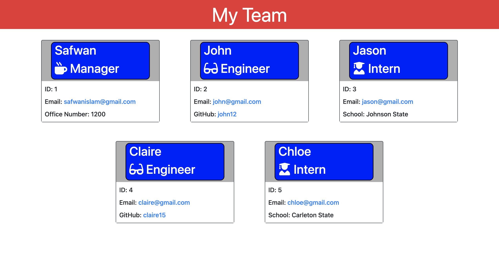

# engineer-page
# README Generator

## Table of Contents 
1. [Description](#description)
2. [Visuals](#visuals)
3. [Resources](#resources)

## Author:

Safwan Islam

## Description
In this challenge, there is code which builds out a html page. The page contains cards for each of the following of the team: manager, engineers, interns. All three have the name, role, symbol, id, and email. Managers have their office number displayed. Engineers have a link to their github repository. Interns have their school listed. This is all based on user entries in the terminal. The page is responsive based on the size of the page, so tablets and smaller devices can also have access to formatted pages. Over, this program displays team members and have specific things to each member's role.

## Visuals

## Resources
[HTML Site](https://raw.githubusercontent.com/saislam10/readme-creator/main/Develop/output/README.md)

[Video Link](https://drive.google.com/file/d/1vIAdpJ3VV05yj0IuYMygDHAmrNXqE_q1/view)

[GitHub Repository](https://github.com/saislam10/engineer-page)